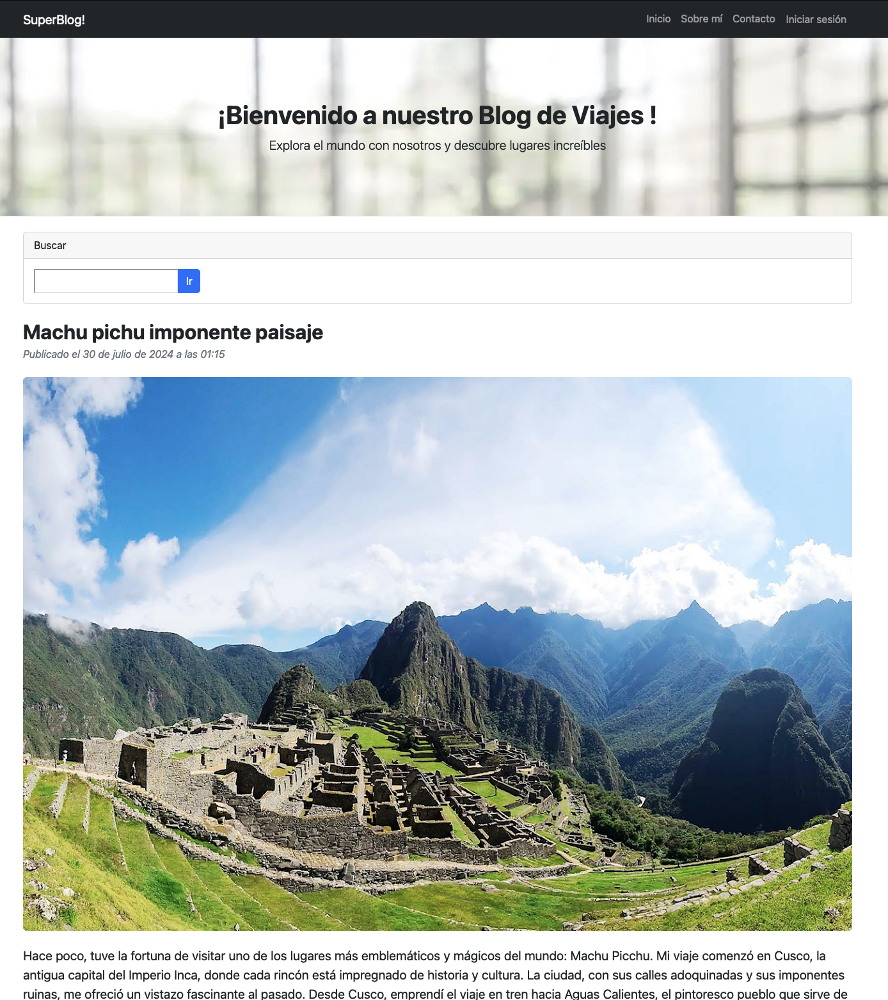
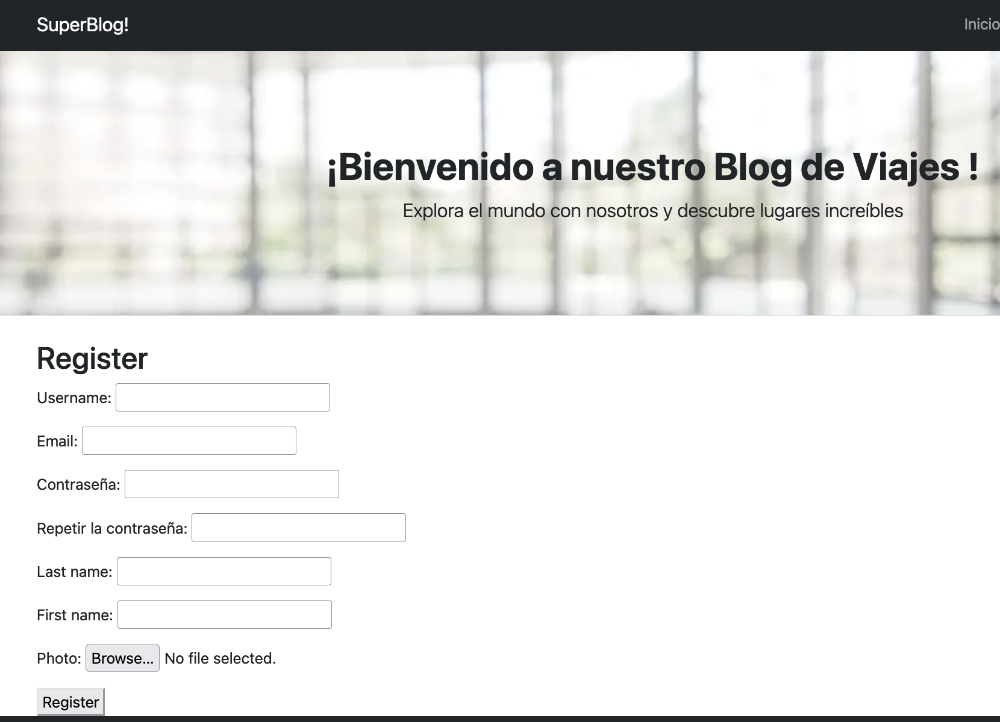
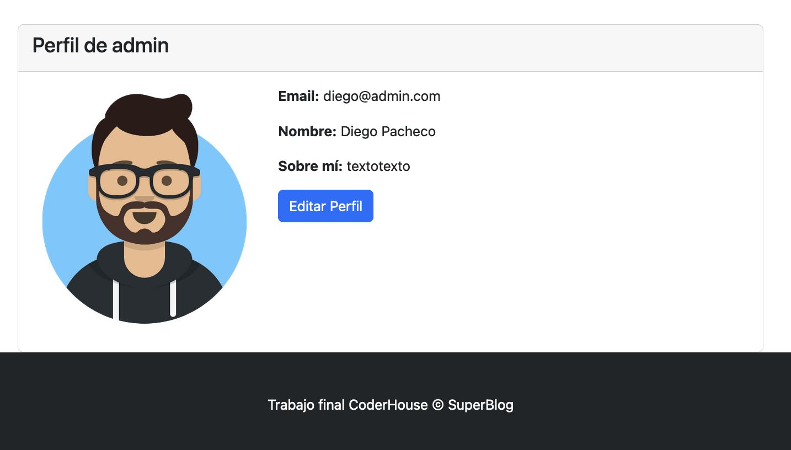
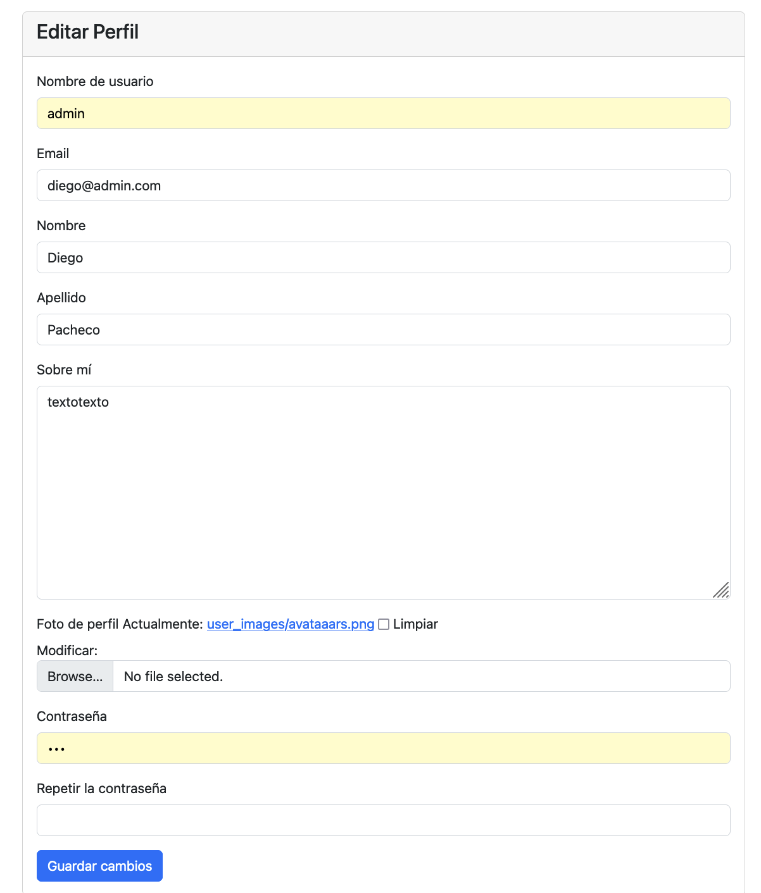

# SuperBlog

SuperBlog es un proyecto final del curso de Python en CoderHouse. Este proyecto es un blog desarrollado con Django, que permite a los usuarios crear, editar y eliminar publicaciones, así como interactuar con otros usuarios.


## Instalación

1. Clona el repositorio:
    ```sh
    git clone https://github.com/bunkerapps/coderhouse_final
    cd coderhouse_final
    ```

2. Crea un entorno virtual y actívalo:
    ```sh
    python -m venv venv
    source venv/bin/activate  # En Windows usa `venv\Scripts\activate`
    ```

3. Instala las dependencias:
    ```sh
    pip install -r requirements.txt
    ```

4. Realiza las migraciones:
    ```sh
    python manage.py migrate
    ```

5. Ejecuta el servidor de desarrollo:
    ```sh
    python manage.py runserver
    ```

## Navegación y Uso

### Página de Inicio

La página de inicio muestra una lista de las publicaciones más recientes. Puedes navegar a las publicaciones más antiguas desplazandote hacia los más antiguos conforme bajas con el scroll.



### Registro e Inicio de Sesión

Los usuarios pueden registrarse y acceder a sus cuentas utilizando los enlaces en la barra de navegación.




### Perfil de Usuario

Cada usuario tiene un perfil donde puede ver y editar su información personal.



### Editar Perfil

Los usuarios pueden editar su perfil, incluyendo su nombre, email, foto de perfil y más.



### Crear y Editar Publicaciones

Los usuarios autenticados pueden crear nuevas publicaciones y editar o eliminar las existentes. Los usuarios NO autenticados en cambio sólo podrán utilizar el campo de búsqueda.


## Comentarios

Los comentarios son bienvenidos! En cada entrada individual los usuarios pueden agregar sus propios comentarios sobre el viaje y comentar experiencias propias o aprovechar ese campo para comunicarse con el creador del POST.


## Contacto

Para cualquier consulta, puedes contactarme a través de mi perfil de GitHub: [bunkerapps](https://github.com/bunkerapps).
